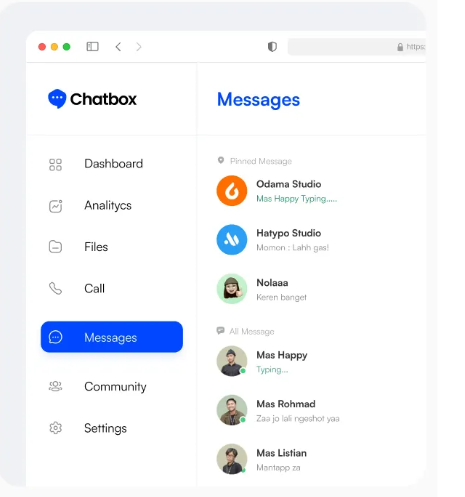

 1. Configuración inicial (head)
En el <head>, se incluyen los siguientes elementos:
•	Codificación y responsividad
html
CopiarEditar
<meta charset="utf-8"/>
<meta content="width=device-width, initial-scale=1.0" name="viewport"/>
Define el conjunto de caracteres y ajusta la escala para que la página sea responsiva.
•	Título de la página
html
CopiarEditar
<title>marben</title>
El título que aparecerá en la pestaña del navegador.
•	CDNs de estilos y scripts
html

o	Tailwind CSS: Para estilos rápidos y personalizados.
o	GSAP: Para animaciones en la página.
o	Font Awesome: Para iconos.
o	Google Fonts: Usa la fuente "Inter".
•	Estilos personalizados
css
CopiarEditar

o	Aplica la fuente "Inter" al cuerpo de la página.
o	Define .star-animation, que oculta y reduce elementos inicialmente (GSAP animará esto después).
________________________________________
 2. Cuerpo de la página (body)
 Encabezado (header)
html
CopiarEditar
<header class="bg-blue-600 text-white star-animation">
    

        

            
            <h1 class="text-2xl font-bold">Chatbox</h1>
        

        <nav class="hidden md:flex space-x-8">
            <a class="hover:underline" href="#">Hogar</a>
            <a class="hover:underline" href="#">Funciones</a>
            <a class="hover:underline" href="#">Precios</a>
            <a class="hover:underline" href="#">Contacto</a>
        </nav>
        

            <button class="bg-white text-blue-600 px-4 py-2 rounded-full hover-effect">Iniciar sesión</button>
        

    

</header>
•	Muestra el logo y el nombre de Chatbox.
•	Un menú de navegación con enlaces (oculto en pantallas pequeñas).
•	Un botón para iniciar sesión.
________________________________________
Sección Hero
html
CopiarEditar
<section class="bg-blue-600 text-white text-center py-20 star-animation">
•	Contiene el mensaje principal de la aplicación con un título grande y un botón de inicio.
________________________________________
 Imagen centrada con fondo dividido
html
CopiarEditar
<section class="relative flex justify-center items-center h-[700px] px-24 star-animation">
    

    

        
    

</section>
•	Divide el fondo en dos colores (azul arriba y blanco abajo).
•	Muestra una imagen de la aplicación en el centro.
________________________________________
Sección de títulos
html
CopiarEditar
<section class="flex justify-center space-x-8 py-8 bg-white star-animation">
    <h2 class="text-gray-600 font-bold text-xl">Rayas</h2>
    <h2 class="text-gray-600 font-bold text-xl">Pago posterior</h2>
    <h2 class="text-gray-600 font-bold text-xl">Esperanza</h2>
    <h2 class="text-gray-600 font-bold text-xl">Spluk</h2>
    <h2 class="text-gray-600 font-bold text-xl">Atenta</h2>
</section>
•	Muestra varias categorías o características destacadas de la aplicación.
________________________________________
 Razones para elegir Chatbox
html
CopiarEditar
<section class="text-center mb-16 star-animation">
•	Contiene una lista de beneficios, con iconos de Font Awesome y diferentes estilos de tarjetas.
________________________________________
Sección de estadísticas
html
CopiarEditar

    <section class="text-left w-1/2">
        <h3 class="text-2xl font-bold mb-4">Comuníquese de manera  más eficiente utilizando Chatbox</h3>
        
envía mensajes fácilmente utilizando solo aplicaciones móviles o de escritorio...

        

            
<h4 class="text-4xl font-bold">1M+</h4>
Usuarios

            
<h4 class="text-4xl font-bold">2M+</h4>
Mensajes enviados

            
<h4 class="text-4xl font-bold">2+</h4>
Años en el negocio

        

    </section>
    

•	Muestra estadísticas sobre usuarios, mensajes y años en el negocio.
________________________________________
 Pie de página (footer)
html
CopiarEditar
<footer class="bg-black text-gray-600 py-16">
    

•	Contiene información de contacto.
•	Un menú con enlaces a diferentes secciones de la página.
•	Derechos reservados.
________________________________________
 3. Animaciones con GSAP
js
CopiarEditar

•	Usa GSAP para animar todos los elementos con la clase .star-animation, haciéndolos aparecer con un efecto de escala.
________________________________________
 Conclusión
Este código crea una página atractiva y moderna para promocionar una aplicación de mensajería. Utiliza Tailwind CSS para el diseño, GSAP para animaciones y Font Awesome para iconos.
🔹 Características clave
 Diseño responsivo
Animaciones suaves
Interfaz limpia y profesional
 Estadísticas y botones interactivos
Si necesitas mejorar o personalizar algo, dime qué necesitas. 

